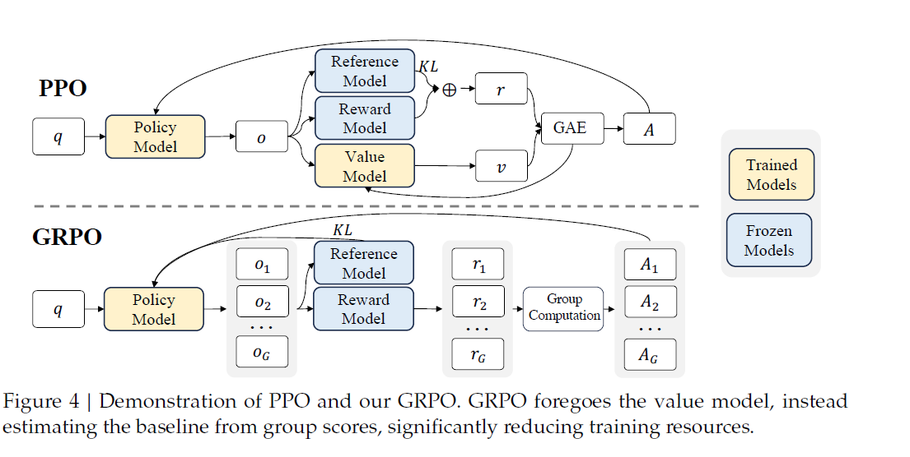

# Group Relative Policy Optimization (GRPO): Concept and Mathematical Foundations

## Introduction

Group Relative Policy Optimization (GRPO) is a reinforcement learning (RL) algorithm designed to enhance the reasoning capabilities of large language models (LLMs). Introduced in the DeepSeekMath paper by researchers at DeepSeek, GRPO offers a streamlined alternative to traditional methods like Proximal Policy Optimization (PPO) by eliminating the need for a value function estimator, thereby reducing computational complexity and memory overhead. :contentReference[oaicite:0]{index=0}

## Conceptual Overview

Traditional policy optimization methods, such as PPO, rely on estimating the value function to assess the expected return of a policy. GRPO simplifies this approach by focusing on the relative performance of actions within a group sampled from the current policy. This group-based comparison aligns well with the comparative nature of reward models, particularly in tasks requiring nuanced reasoning.

## Mathematical Foundations

The GRPO algorithm operates as follows:

1. **Action Sampling**: For each state $s$, sample a group of $G$ actions $ {a_1, a_2, \ldots, a_G} $ from the current policy $ pi_{\theta_t} $.

2. **Reward Evaluation**: Compute the rewards $ {r(s, a_1), r(s, a_2), \ldots, r(s, a_G)} $ for these actions.

3. **Group-Relative Advantage Calculation**: Normalize the rewards within the group to obtain the group-relative advantages:

$$A^{\pi_{\theta_t}}(s, a_j) = \frac{r(s, a_j) - \mu}{\sigma}$$

   where $\mu$ and  $\sigma$ are the mean and standard deviation of the rewards \( \{r(s, a_1), r(s, a_2), \ldots, r(s, a_G)\} \). This standardization measures each action's reward relative to its peers, facilitating a more stable and comparative learning process. :contentReference[oaicite:1]{index=1}

4. **Policy Update Objective**: Maximize the following objective function, averaged over all actions:
   $$
   \max_\theta \frac{1}{G} \sum_{i=1}^G \mathbb{E}_{(s, a_1, \ldots, a_G) \sim \pi_{\theta_t}}\left[ \begin{cases} \min \left(\frac{\pi_\theta(a_i|s)}{\pi_{\theta_t}(a_i|s)}, 1 + \epsilon \right) A^{\pi_{\theta_t}}(s, a_i) & \text{if } A^{\pi_{\theta_t}}(s, a_i) > 0 \\ \max \left(\frac{\pi_\theta(a_i|s)}{\pi_{\theta_t}(a_i|s)}, 1 - \epsilon \right) A^{\pi_{\theta_t}}(s, a_i) & \text{if } A^{\pi_{\theta_t}}(s, a_i) < 0 \end{cases} \right]
   $$
   This objective function encourages the policy to increase the probability of actions that perform relatively better within the sampled group and decrease the probability of those that perform worse. :contentReference[oaicite:2]{index=2}

5. **KL Divergence Penalty**: To prevent the policy from deviating too far from a reference policy \( \pi_{\text{ref}} \), a Kullback-Leibler (KL) divergence penalty is incorporated:
   $$
   -\beta \mathbb{E}_{s, a \sim \pi_{\theta_t}}\left[\log\left(\frac{\pi_{\theta}(a|s)}{\pi_{\text{ref}}(a|s)}\right) \right]
   $$
   where $ \beta $ adjusts the strength of the penalty. This term ensures that the updated policy remains close to the reference policy, maintaining stability during trainings.

## Advantages of GRPO

- **Simplified Architecture**: By eliminating the value function estimator, GRPO reduces memory and computational requirements, streamlining the training process.

- **Enhanced Stability**: The group-relative advantage calculation provides a more stable learning signal by focusing on the relative performance of actions within a group, mitigating the impact of outliers.

- **Alignment with Comparative Rewards**: GRPO's methodology aligns well with reward models based on comparative feedback, making it particularly suitable for tasks like mathematical reasoning where relative performance is crucial.

## Applications

GRPO has been effectively applied in training LLMs for complex reasoning tasks. Notably, it was utilized in developing DeepSeekMath 7B, a model that achieved significant improvements in mathematical problem-solving benchmarks.

## Conclusion

Group Relative Policy Optimization represents a significant advancement in reinforcement learning for large language models. By focusing on group-relative advantages and simplifying the policy optimization process, GRPO offers a more efficient and stable alternative to traditional methods, particularly in domains requiring sophisticated reasoning capabilities.
